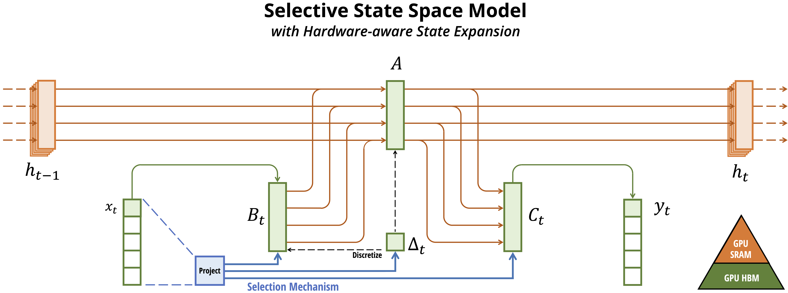

# Mamba-ESI: Introducing Embedding Search to Selective SSMs


> **Mamba-ESI: Introducing Embedding Search to Selective SSMs**\
> Peter Chin (Advisor), Yu-Wing Tai (Advisor), Abhinav Reddy, Aniket Dey\
> *Based on the original Mamba architecture by Albert Gu*, Tri Dao*\
> Original Paper: https://arxiv.org/abs/2312.00752

## About

Mamba-ESI extends the Mamba sequence model architecture with an embedding search and injection (ESI) mechanism to efficiently handle long input sequences, such as entire textbooks. While the original Mamba showed promising performance on information-dense data like language modeling, efficiently capturing and utilizing relevant information from distant parts of very long sequences remained challenging.

Mamba-ESI addresses this by introducing a dynamic attention mechanism that computes embeddings for questions and input tokens, performs similarity search to identify the most relevant tokens, and injects their corresponding hidden states into the current model state. This approach enables the model to selectively amplify pertinent information without storing and processing the entire memory tensor, effectively performing a kernel trick on the fly.

The architecture is built upon the original Mamba's efficient hardware-aware design and selective state space model foundation, with significant memory and computational efficiency improvements for long-sequence tasks like textbook question answering.

## Installation

- [Option] `pip install causal-conv1d>=1.2.0`: an efficient implementation of a simple causal Conv1d layer used inside the Mamba block.
- `pip install mamba-ssm`: the core Mamba package.

It can also be built from source with `pip install .` from this repository.

If `pip` complains about PyTorch versions, try passing `--no-build-isolation` to `pip`.

Other requirements:
- Linux
- NVIDIA GPU
- PyTorch 1.12+
- CUDA 11.6+

## Usage

We expose several levels of interface with the Mamba-ESI model.

### Selective SSM

Mamba-ESI is based on the original selective SSM layer from Mamba (Section 3; Algorithm 2 of the original paper).

Source: [ops/selective_scan_interface.py](mamba_ssm/ops/selective_scan_interface.py).

### Mamba Block

The core Mamba architecture block wrapping the selective SSM remains unchanged.

Source: [modules/mamba_simple.py](mamba_ssm/modules/mamba_simple.py).

Usage:
```python
import torch
from mamba_ssm import Mamba

batch, length, dim = 2, 64, 16
x = torch.randn(batch, length, dim).to("cuda")
model = Mamba(
    # This module uses roughly 3 * expand * d_model^2 parameters
    d_model=dim, # Model dimension d_model
    d_state=16,  # SSM state expansion factor
    d_conv=4,    # Local convolution width
    expand=2,    # Block expansion factor
).to("cuda")
y = model(x)
assert y.shape == x.shape
```

### Mamba-ESI Language Model

The key innovation in Mamba-ESI is the enhanced language model that incorporates embedding search and injection for question-aware processing of long sequences.

Source: [models/mixer_seq_simple.py](mamba_ssm/models/mixer_seq_simple.py).

Usage:
```python
import torch
from mamba_ssm.models.mixer_seq_simple import MambaLMHeadModel

# Load the model
model = MambaLMHeadModel.from_pretrained("state-spaces/mamba-130m")

# Example for question answering on long sequences
input_ids = torch.randint(1, 1000, (1, 2048)).to("cuda")  # Long sequence
question_ids = torch.randint(1, 1000, (1, 20)).to("cuda")  # Question tokens

# Forward pass with embedding search and injection
output = model(input_ids, question_ids)
logits = output.logits
```

#### Embedding Search and Injection Mechanism

The ESI mechanism works by:
1. Computing question embeddings from question tokens
2. Projecting input token embeddings to the same space
3. Computing similarity scores between question and input embeddings
4. Selecting top-k most relevant tokens based on similarity
5. Injecting relevant hidden states into the current model state

This enables dynamic attention to pertinent information across very long sequences without the quadratic memory requirements of traditional attention mechanisms.

## Pretrained Models

Mamba-ESI is compatible with the original Mamba pretrained models available on
[Hugging Face](https://huggingface.co/state-spaces): `mamba-130m`, `mamba-370m`,
`mamba-790m`, `mamba-1.4b`, `mamba-2.8b`, trained on 300B tokens on the Pile, as well as `mamba-2.8b-slimpj`
(trained on 600B tokens on the SlimPajama dataset).

The models will be autodownloaded by the generation script below.

These models follow the standard model dimensions described by GPT-3:

| Parameters | Layers | Model dim. | 
|------------|--------|------------|
| 130M       | 24     | 768        |
| 370M       | 48     | 1024       |
| 790M       | 48     | 1536       |
| 1.4B       | 48     | 2048       |
| 2.8B       | 64     | 2560       |

Note: The ESI mechanism adds minimal parameters (embedding projection and injection layers) to the original architecture.

## Evaluations

To run zero-shot evaluations of models, we use the
[lm-evaluation-harness](https://github.com/EleutherAI/lm-evaluation-harness/tree/big-refactor)
library.

1. Pull the `lm-evaluation-harness` repo by `git submodule update --init
   --recursive`. We use the `big-refactor` branch.
2. Install `lm-evaluation-harness`: `pip install -e 3rdparty/lm-evaluation-harness`.
On Python 3.10 you might need to manually install the latest version of `promptsource`: `pip install git+https://github.com/bigscience-workshop/promptsource.git`.
3. Run evaluation with (more documentation at the [lm-evaluation-harness](https://github.com/EleutherAI/lm-evaluation-harness/tree/big-refactor) repo):
```
python evals/lm_harness_eval.py --model mamba --model_args pretrained=state-spaces/mamba-130m --tasks lambada_openai,hellaswag,piqa,arc_easy,arc_challenge,winogrande --device cuda --batch_size 64
python evals/lm_harness_eval.py --model hf --model_args pretrained=EleutherAI/pythia-160m --tasks lambada_openai,hellaswag,piqa,arc_easy,arc_challenge,winogrande --device cuda --batch_size 64
```

For long-sequence tasks and question answering evaluations, Mamba-ESI demonstrates competitive performance while maintaining significant memory and computational efficiency compared to state-of-the-art methods.

## Inference

The script [benchmarks/benchmark_generation_mamba_simple.py](benchmarks/benchmark_generation_mamba_simple.py)
1. autoloads a model from the Hugging Face Hub,
2. generates completions of a user-specified prompt,
3. benchmarks the inference speed of this generation.

### Examples

To test generation latency with Mamba-ESI:

```
python benchmarks/benchmark_generation_mamba_simple.py --model-name "state-spaces/mamba-2.8b" --prompt "My cat wrote all this CUDA code for a new language model and" --topp 0.9 --temperature 0.7 --repetition-penalty 1.2
```

To test generation throughput with random prompts:
```
python benchmarks/benchmark_generation_mamba_simple.py --model-name "state-spaces/mamba-2.8b" --batch 128
```

## Troubleshooting

### Precision
Our models were trained using PyTorch [AMP](https://pytorch.org/docs/stable/amp.html) for mixed precision. AMP keeps model parameters in float32 and casts to half precision when necessary.

We've observed that higher precision for the main model parameters may be necessary, because SSMs are sensitive to their recurrent dynamics. If you are experiencing instabilities,
as a first step please try a framework storing parameters in fp32 (such as AMP).

### Initialization
Some parts of the model have initializations inherited from prior work on S4 models.
The ESI mechanism uses standard Xavier initialization for the embedding projection and injection layers.

## Citation

If you use this codebase, please cite original Mamba work:

```
@article{mamba,
  title={Mamba: Linear-Time Sequence Modeling with Selective State Spaces},
  author={Gu, Albert and Dao, Tri},
  journal={arXiv preprint arXiv:2312.00752},
  year={2023}
}
